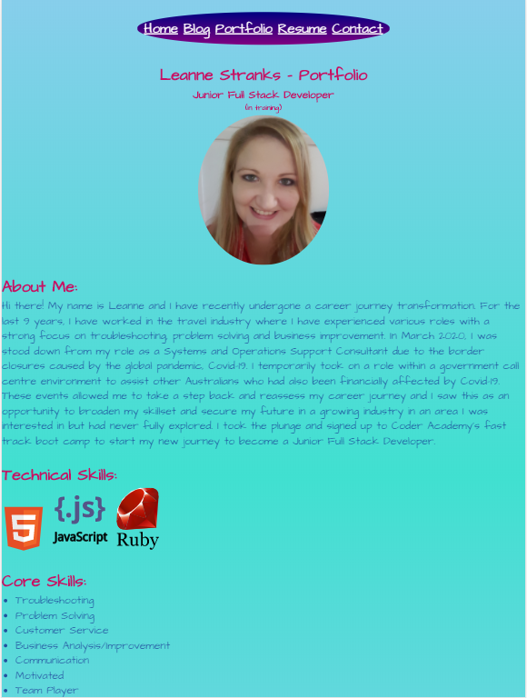

# LeanneStranks_T1A2

### Link to Published Portfolio Website:

(https://zealous-pasteur-47f146.netlify.app/index.html)

### Link to Portfolio ED Workspace:

(https://edstem.org/courses/4464/workspaces/pNqeJE1M6WvIfJgEdurh7B0SQlCsnRJm)

#### Purpose
The purpose of my portfolio is to showcase me and my skills, engaging the audience with its simple design and accessibility. It highlights my strengths and shows the viewer an insight as to who they may have working in their company. It allows the prospective employer to get in touch with me to ask questions and discuss employment options. The website includes a portfolio page with a purpose to be a one stop shop to easily view the projects I created. The overall portfolio serves to be an updated online profile of employment history, skills and information which can be easily accessed at any time.

#### Target Audience
The target audience for my portfolio will be for potential employers/contractors seeking a Junior Full Stack Developer

#### Tech Stack
HTML, CSS, Netlify, Ubuntu, Visual Studio Code

#### Functionality/Features
- Navbar located along the top of all pages as a header: Includes a hover effect to change colour when the user moves their mouse over the link.
- 'Back to top' option on the bottom of the home page and on each blog article to allow user to go back to the top of the screen to minimise scrolling.
- Footer on the bottom of each page with Copyright symbol and name.
- Image style portfolio with a hover effect over each image. Images will be linked to each project and will open up in a new browser so user is not navigated away from the portfolio page
- Download resume button on Resume page. The button is styled to be large to stand out. This will open resume in a new browser.
- Clickable social media icons clearly displayed at the top of the contact page - links to open in new browser.
- Contact me form so user can easily get in touch and does not need to navigate away from the page in order to contact.
- Headings on each page (except for Resume) so user knows what page they are on
- Consistent font style and colour scheme throughout pages 

#### Sitemap

#### Screenshots

###### Links for Contact Page:

**Twitter:**
(https://twitter.com/Leanne69390528)

**LinkedIn:**
(https://www.linkedin.com/in/leanne-stranks-18778a164)

**Github**
(https://github.com/Leanne2603)

###### Web Page Screenshots

**Home Page:**

**Blog Page:**

**Portfolio Page:**

**Resume Page:**

**Contact Page:**

